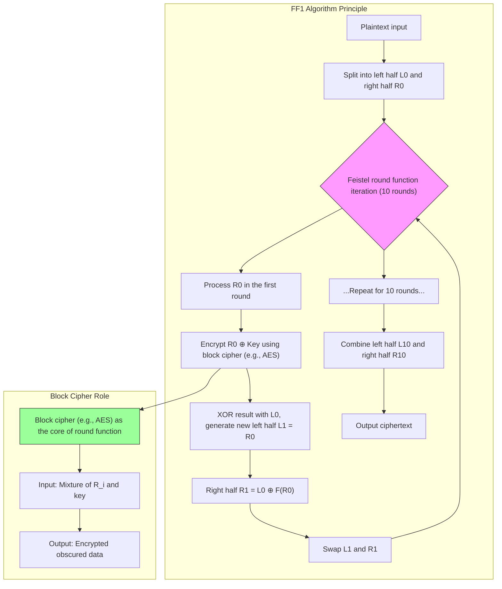

# Format-Preserving Encryption (FPE) Algorithms Sample

This repository contains sample implementations of Format-Preserving Encryption (FPE) algorithms in both Java and JavaScript. It demonstrates the usage of FF1 and FF3-1 ciphers, which are NIST-approved encryption methods that preserve the format of the input data.

## Overview

Format-Preserving Encryption (FPE) is a cryptographic method that encrypts data while maintaining its original format. For example, if you encrypt a credit card number, the result will still be a valid-looking credit card number. This makes FPE particularly useful for:

- Credit card number encryption
- Social security number encryption
- Custom format data encryption
- Legacy system integration where data format must be preserved


### FF1 Algorithm


---

**Explanation**

1. Feistel Structure Flow:
   - Plaintext is split into L0 and R0, processed through 10 rounds of iteration.
   - In each round, the right half R_i is processed by the round function (using a block cipher like AES), XORed with the left half L_i to generate the new right half. The original right half becomes the new left half. (Note: The diagram labels F and G describe this slightly differently, but this is the standard Feistel process FF1 follows).
- After each round, the left and right halves are swapped before proceeding to the next round.
2. Role of the Block Cipher:
   - The block cipher (e.g., AES) acts as the core of the round function, encrypting a value derived from the right-half data mixed with the key (and tweak/round information), generating an obfuscated result.
   - The cryptographic strength of the block cipher directly determines FF1's resistance to attacks.
3. Output Combination:
   - After 10 rounds of iteration, the final left and right halves are combined to produce the format-preserving ciphertext.


---

**Key Points**

- Symmetry of the Feistel Network: Encryption and decryption use the same structure; only the order of round keys/operations needs to be reversed.
- Format-Preserving Property: The length and character set of the input and output data are identical (e.g., encrypting a credit card number still results in a 16-digit number).
- Security Dependency: The algorithm's security relies on both the cryptographic strength of the underlying block cipher and the number of Feistel rounds (FF1 uses 10 rounds).


## Project Structure

```
├── FPE-Java/       # Java implementation using Bouncy Castle
└── FPE-JS/         # JavaScript implementation using ff3 library
```

## Java Implementation

### Prerequisites

- Java 8 or higher
- Maven

### Setup

1. Navigate to the Java project directory:
   ```bash
   cd FPE-Java
   ```

2. Build the project using Maven:
   ```bash
   mvn clean install
   ```

### Usage Examples

#### FF1 Cipher

```java
// Initialize FF1 cipher with custom alphabet
String alphabet = "!@#$ABCD";
FF1Cipher cipher = new FF1Cipher(alphabet);

// Encrypt and decrypt
String plainText = "AB@CD#BADC";
String cipherText = cipher.encrypt(plainText);
String decryptedText = cipher.decrypt(cipherText);

// Using numeric alphabet
cipher = new FF1Cipher(FF3Cipher.DIGITS);
plainText = "34692827";
cipherText = cipher.encrypt(plainText);
decryptedText = cipher.decrypt(cipherText);
```

#### FF3-1 Cipher

```java
// Initialize FF3-1 cipher with custom alphabet
String alphabet = FF3Cipher.DIGITS + FF3Cipher.ASCII_LOWERCASE;
FF3Cipher cipher = new FF3Cipher(alphabet);

// Encrypt and decrypt
String plainText = "123abc456def";
String cipherText = cipher.encrypt(plainText);
String decryptedText = cipher.decrypt(cipherText);
```

## JavaScript Implementation

### Prerequisites

- Node.js 12 or higher
- npm

### Setup

1. Navigate to the JavaScript project directory:
   ```bash
   cd FPE-JS
   ```

2. Install dependencies:
   ```bash
   npm install
   ```

### Usage Examples

```javascript
const FF3Cipher = require('./index.js');

// Initialize cipher with key and tweak
const key = 'EF4359D8D580AA4F7F036D6F04FC6A94';
const tweak = '2024';
const cipher = new FF3Cipher(key, tweak);

// Encrypt and decrypt
const plaintext = '123456789';
const ciphertext = cipher.encrypt(plaintext);
const decrypted = cipher.decrypt(ciphertext);
```

## Security Considerations

- Use strong, randomly generated keys
- Keep tweak values unique for each encryption operation
- Follow NIST recommendations for minimum and maximum input lengths
- Ensure your alphabet size meets the minimum requirements for the chosen algorithm

## References

- [NIST Special Publication 800-38G](https://nvlpubs.nist.gov/nistpubs/SpecialPublications/NIST.SP.800-38G.pdf)
- [Bouncy Castle Crypto Package](https://www.bouncycastle.org/)
- [FF3 JavaScript Implementation](https://github.com/mysto/node-fpe)

## License

This project is licensed under the MIT License - see the LICENSE file for details.
